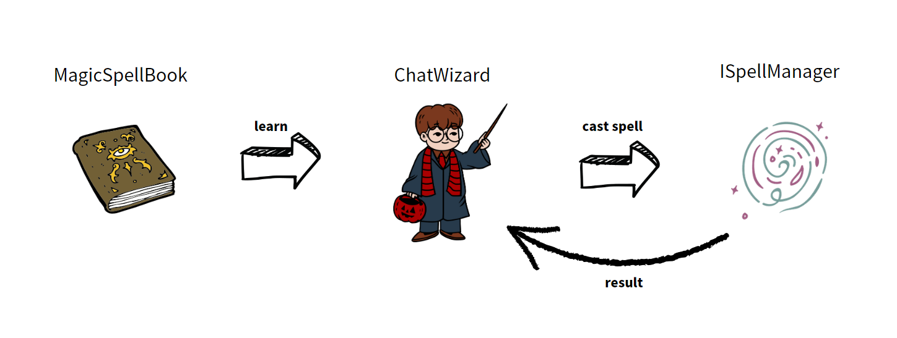

# OmniGPT

[](https://jitpack.io/#tbwork/MagicGPT)  [](https://opensource.org/licenses/MIT)

Give wings to GPT - with MagicGPT, you can enable GPT to access local methods, Restful API interfaces, common search engines, specified URLs of web pages, relational databases, vector databases, and more, anytime and anywhere as needed.


## Motivation

In March 2023, with the release of ChatGPT based on GPT-3.5 by OpenAI, Large Language Models (LLMs) have ignited the fuse of the AI era. I am eagerly anticipating the maturity of the AI era, when productivity will reach unprecedented heights, and people will have more time to pursue their passions and explore the meaning of life. Before that, open frameworks for GPT in various programming languages should be made available to engineers, so that software developers in all industries can gradually use AI to optimize specific scenarios.

This framework is designed for Java programmers, and we also welcome developers from other programming languages to discuss MagicGPT solutions for their languages. If you are interested, you can contact us through the QQ group.

## Current supported features

| Feature           | Supported | Version  |
|-------------------|-----------|----------|
| Local methods     | YES       | \>=1.0.0 |
| Restful API       | YES       | \>=1.0.0 |
| Web Page          | YES       | \>=1.0.0 |
| Search Engine     | YES       | \>=1.0.0 |
| Relation Database | NO        | -        |
| Vector Datebase   | NO        | -        |


## The mechanism of the MagicGPT

To help everyone better understand the design concept of MagicGPT, we have adopted the popular and easy-to-understand mechanism of the magical world, as shown in the following diagram:



You can find corresponding class names in the code and understand their meanings at a glance, just as depicted in all magic worlds:

1. Each magic book records different magic spells.
2. Each magician has his own magic book.
3. The process of executing a spell when a wizard recites it is implemented by the magic manager of this magic world mechanism, but this point will not be mentioned in the story. 

The above can help you quickly understand the relationships and functions of each class. When using it, please note:

1. "ChatWizard" refers to the GPT AI virtual robot that has learned spells.
2. A magician essentially binds a series of spells, and the spells bound by different magicians are also different.
3. Each magician can provide a new AI answer for a context.
4. When you ask a wizard to generate an answer based on a dialogue context, you need to specify an output stream.

> Currently, MagicGPT only provides streaming responses, because synchronous responses are too slow.


## How to use

The following sample code demonstrates a basic usage process.

> Preparation: Make sure that the anole-loader local configuration management framework has been started in the program. For specific usage, please refer to [anole-loader](https://github.com/tbwork/anole-config); This is a foolproof local configuration management framework that can access almost any location of KV configuration without worrying about where the definition file is.

### Start a chat
```java

        // Loading Custom Prompt Words
        String customSystemPrompt = PromptUtil.readTestResourceFile("custom_prompts/time_reporter.prompt");

        // Specify the package name to search for local Call-type spells.
        MagicGPT magicGPT = new MagicGPT("cn.lanehub.ai.examples.timeReporter", "Time reporter",  AIWizardType.GPT4);

        // Creating a chat
        Chat magicChat = magicGPT.startChat("Hello, I'am a time reporter!", customSystemPrompt, Language.CHINESE);
```

### Proceed a chat

Output to console:

```java

        // User inputs a sentence to initiate a chat and specifies the output stream to the console.
        magicGPT.proceedChatWithUserMessage(input, magicChat, TestUtil.getConsoleOutputStream());

```

Output to HttpResponse：
```java

        OutputStream outputStream = response.getEntity().getContent();

        // User inputs a sentence, a chat is pushed forward, and HttpResponse output stream is specified.
        magicGPT.proceedChatWithUserMessage(input, magicChat, outputStream);

```

The complete runnable code can be found in "cn.lanehub.ai.examples" under "src/test/java" directory.


## How to contribute to the code
1. Make sure you have a complete understanding of the MagicGPT magic world mechanism.
2. Any form of contribution is welcome: issue suggestions, pull requests, group recommendations, etc.
3. If you want to modify the code in this repository, please create a relevant issue first and then submit a pull request.
4. Do not expose any private data in the code. We cannot assume any responsibility for data breaches.


## Donation


## Study and Discussion Group (QQ)


## Open Source License

This project follows the [MIT Open Source License](https://opensource.org/licenses/MIT).
