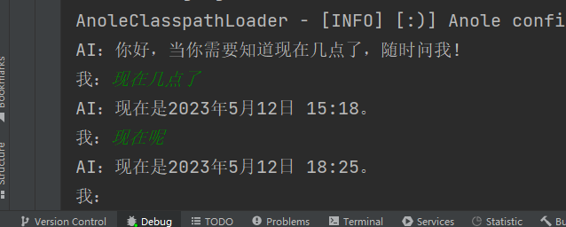

# MagicGPT 

[English Document](/README_EN.md)

[](https://jitpack.io/#tbwork/MagicGPT)  [](https://opensource.org/licenses/MIT)  

让人工智能体使用你本地提供的方法工具来完成任务。你可以使用MagicGPT轻松帮你完成：

1. 从大量无规律文本中清洗数据
2. 7X24小时打标签的标签员、审核员
3. 7X24小时的帖子管理员
4. 替代你公司的后台型员工（即依赖自研后台系统完成任务的工种）
5. 更多可能，等你来实现。


## 初衷

2023年3月随着OpenAI发布了基于GPT-3.5的ChatGPT，大语言模型（LLM）点燃了AI时代的导火索。本人非常期待AI时代的成熟期到来，届时生产力将前所未有的发达，大家可以有很多的时间做自己喜欢的事情，探索人生的意义。在这之前，各类编程语言的GPT开放式框架应当被提供出来供工程师们使用，以便各行各业的软件开发者可以逐步使用AI来优化特定的场景。

本框架是为Java编程者提供的，也欢迎其他语言的开发者们可以共同探讨其他语言的MagicGPT解决方案，如果您有兴趣，可以通过QQ群联系我们。

## 目前功能支持情况

| 功能点       | 是否支持 | 支持版本     |
|-----------|----|----------|
| 本地方法      | YES | \>=1.0.0 |

> 一切其他调用都可以转变为本地方法，因此新版本MagicGPT将只提供本地方法，未来可能会提供更多的接入形式，但最终会转变为本地方法。
> 其他的网络调用、数据库访问、向量数据库查询均可以封装为本地方法。


## MagicGPT魔法世界机制

为了帮助大家更好地理解MagicGPT的设计思路，我们采用了通俗易懂的魔法世界机制，如下图所示：

 

以上可以帮助大家快速理解各个类的关系和作用。在使用时需要注意：
1. “对话魔法师(ChatWizard)”就是指学习了咒语的GPT AI虚拟机器人。
2. 一个魔法师本质上绑定了一系列的咒语，不同的魔法师所绑定的咒语也是不一样的。
3. 每个魔法师都可以为一个上下文补足新的一个AI回答。
4. 当你要求魔法师基于一个对话上下文进行回答生成时，需要指定一个输出流。

> 目前MagicGPT仅提供了流式返回，原因是同步返回实在太慢。


## 基本用法

下面示例代码演示了一个基本的使用流程。 如果需要可运行的代码，查看[TestTimeReporter.java](src/test/java/com/magicvector/ai/examples/timeReporter/TestTimeReporter.java) 
```java

    // 创建帮助类
    MagicGPT magicGPT = new MagicGPT(...);

    // 创建聊天
    MagicChat magicChat = magicGPT.startChat(...);

    // 指定输出流，推进对话
    magicGPT.proceedChatWithUserMessage(magicChat, "你说的话", OutputStream);

```

> 准备工作： 确保程序已经启动了本地配置管理框架anole-loader，具体用法参考[anole-loader](https://github.com/tbwork/anole-config);
> 这是一个傻瓜式本地配置管理框架，几乎可以访问任何位置的kv配置，而无需关心定义文件在哪里。

### 依赖配置

如果您没有配置JitPack仓库，需要在项目的pom.xml中加上：
```xml
    <repositories>
        <repository>
            <id>jitpack.io</id>
            <url>https://jitpack.io</url>
        </repository>
    </repositories>

```
> 也可以在.m2/settings.xml中配置


然后引入MagicGPT包:

```xml

    <dependency>
        <groupId>com.github.tbwork</groupId>
        <artifactId>MagicGPT</artifactId>
        <version>${version}</version>
    </dependency>

```


Gradle，SBT，Leiningen等其他包管理方式参考： https://jitpack.io/#tbwork/MagicGPT


### 设置关键变量

#### GPT3/4 大模型

将OPENAI_API_KEY配置到系统环境中。以下是不同操作系统设置环境变量的方法：

Windows

```
打开“控制面板”，选择“系统和安全”>“系统”>“高级系统设置”。

在“系统属性”对话框中，选择“高级”选项卡，然后在“环境变量”下点击“环境变量”按钮。

在“环境变量”对话框中，可以添加、编辑和删除用户变量和系统变量。

若要添加一个新的系统变量，选择“新建”按钮，输入变量名和变量值，然后点击“确定”。
```

MacOS

```
在 macOS 中，打开“终端”应用程序。

输入以下命令：nano ~/.bash_profile，然后按 Enter 键。

在文本编辑器中，可以添加、编辑和删除环境变量。

添加完毕后，按 Control + O 键保存，然后按 Control + X 键退出。
```

Linux

```
在 Linux 中，打开终端应用程序。

输入以下命令：nano ~/.bashrc，然后按 Enter 键。

在文本编辑器中，可以添加、编辑和删除环境变量。

添加完毕后，按 Control + O 键保存，然后按 Control + X 键退出。
```

当然也可以在任意.anole文件、.properties文件中定义（这种方法不推荐，会带来数据安全问题）。


### 开启一个对话
```java

    // 指定包名搜索本地Call类型咒语
    MagicGPT magicGPT = new MagicGPT(TestTimeReporter.class.getPackage().getName(),
            OpenAIModel.GPT4_O4_MINI,
            true
    ); 
    // 指定包名搜索本地Call类型咒语
    MagicGPT magicGPT = new MagicGPT(
            TestTimeReporter.class.getPackage().getName(),
            OpenAIModel.GPT4_O4_MINI,
            true
    );
    // 创建聊天
    MagicChat magicChat = magicGPT.startChat(CustomPrompt.buildHeadPrompt(headCustomPrompt), Language.CHINESE);

```

### 推进对话

输出到控制台：

```java

    // 推进一个聊天，指定一个输出流用于承载AI的输出
    magicGPT.proceedChatWithUserMessage(magicChat, input, new SystemOutputStream());

```

输出到HttpResponse：
```java

    OutputStream outputStream = response.getEntity().getContent();

    // 用户输入一句话，推进一个聊天，指定HttpResponse输出流
    magicGPT.proceedChatWithUserMessage(input, magicChat, outputStream);

```

完整的可运行代码在src/test/java的com.magicvector.ai.examples下。


**运行效果图：**




## 如何贡献代码
1. 确定自己已经完全理解了MagicGPT的魔法世界机制。
2. 欢迎任何形式的贡献：ISSUE建议、Pull Request、加群建议等。
3. 如果想要在本仓库改动代码，请先创建相关ISSUE，然后再提交Pull Request。
4. 不要将任何隐私数据暴露到代码中，我们对数据泄露无法担负任何责任。


## 捐赠


## 微信讨论群


## 开源许可

本项目遵循 [MIT 开源许可](https://opensource.org/licenses/MIT)。
