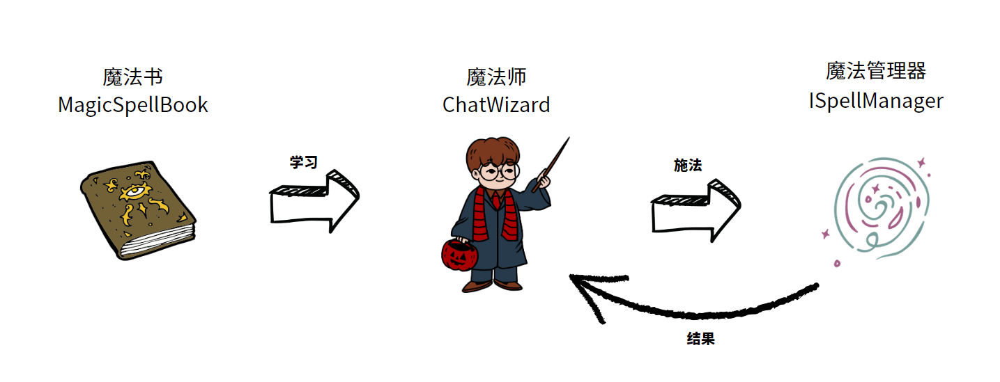

# OmniGPT 

[English Document](/README.md)

[](https://jitpack.io/#tbwork/MagicGPT)  [](https://opensource.org/licenses/MIT)  

给GPT装上翅膀——通过MagicGPT，你可以让GPT随时随地按需访问本地方法、Restful API接口、常见搜索引擎、指定URL地址的网页、关系型数据库、向量数据库等。


## 初衷

2023年3月随着OpenAI发布了基于GPT-3.5的ChatGPT，大语言模型（LLM）点燃了AI时代的导火索。本人非常期待AI时代的成熟期到来，届时生产力将前所未有的发达，大家可以有很多的时间做自己喜欢的事情，探索人生的意义。在这之前，各类编程语言的GPT开放式框架应当被提供出来供工程师们使用，以便各行各业的软件开发者可以逐步使用AI来优化特定的场景。

本框架是为Java编程者提供的，也欢迎其他语言的开发者们可以共同探讨其他语言的MagicGPT解决方案，如果您有兴趣，可以通过QQ群联系我们。

## 目前功能支持情况

| 功能点       | 是否支持 | 支持版本     |
|-----------|--|----------|
| 本地方法      | YES | \>=1.0.0 |
| Restful接口 | YES | \>=1.0.0 |
| 网页访问      | YES | \>=1.0.0    |
| 百度搜索引擎    | YES | \>=1.0.0    |
| 关系型数据库访问  | NO | -        |
| 向量数据库访问   | NO | -        |


## MagicGPT魔法世界机制

为了帮助大家更好地理解MagicGPT的设计思路，我们采用了通俗易懂的魔法世界机制，如下图所示：



大家可以从代码中找到对应的一些类名，一看便知其意。正如所有的魔法世界中描绘的一样：
1. 每一本魔法书都记载了不同的魔法咒语。
2. 每个魔法师都会有一本自己的魔法书。
3. 魔法师念出咒语，咒语被执行的过程由这个魔法世界机制的魔法管理器来实现，当然，这个点在故事里并不会被提及。

以上可以帮助大家快速理解各个类的关系和作用。在使用时需要注意：
1. “对话魔法师(ChatWizard)”就是指学习了咒语的GPT AI虚拟机器人。
2. 一个魔法师本质上绑定了一系列的咒语，不同的魔法师所绑定的咒语也是不一样的。
3. 每个魔法师都可以为一个上下文补足新的一个AI回答。
4. 当你要求魔法师基于一个对话上下文进行回答生成时，需要指定一个输出流。

> 目前MagicGPT仅提供了流式返回，原因是同步返回实在太太太慢了。


## 基本用法

下面示例代码演示了一个基本的使用流程。 如果需要可运行的代码，查看[TestTimeReporter.java](src/test/java/cn/lanehub/ai/examples/timeReporter/TestTimeReporter.java) 

> 准备工作： 确保程序已经启动了本地配置管理框架anole-loader，具体用法参考[anole-loader](https://github.com/tbwork/anole-config);
> 这是一个傻瓜式本地配置管理框架，几乎可以访问任何位置的kv配置，而无需关心定义文件在哪里。

### 依赖配置

如果您没有配置JitPack仓库，需要在项目的pom.xml中加上：
```xml
    <repositories>
        <repository>
            <id>jitpack.io</id>
            <url>https://jitpack.io</url>
        </repository>
    </repositories>

```
> 也可以在.m2/settings.xml中配置


然后引入MagicGPT包:

```xml

    <dependency>
        <groupId>com.github.tbwork</groupId>
        <artifactId>MagicGPT</artifactId>
        <version>${version}</version>
    </dependency>

```


Gradle，SBT，Leiningen等其他包管理方式参考： https://jitpack.io/#tbwork/MagicGPT


### 开启一个对话
```java

        // 创建MagicGPT：指定包名搜索本地Call类型咒语
        MagicGPT magicGPT = new MagicGPT("<package name>", "时间播报员",  AIWizardType.GPT4);

        // 加载自定义提示词
        String customSystemPrompt = "你是一个时间播报员，随时按照用户的需求播报时间。";

        
        // 创建聊天
        Chat magicChat = magicGPT.startChat("你好，我是时间播报员！", customSystemPrompt, Language.CHINESE);
```

### 推进对话

输出到控制台：

```java

        // 用户输入一句话，推进一个聊天，指定控制台输出流
        magicGPT.proceedChatWithUserMessage(input, magicChat, TestUtil.getConsoleOutputStream());

```

输出到HttpResponse：
```java

        OutputStream outputStream = response.getEntity().getContent();

        // 用户输入一句话，推进一个聊天，指定HttpResponse输出流
        magicGPT.proceedChatWithUserMessage(input, magicChat, outputStream);

```

完整的可运行代码在src/test/java的cn.lanehub.ai.examples下。


## 如何贡献代码
1. 确定自己已经完全理解了MagicGPT的魔法世界机制。
2. 欢迎任何形式的贡献：ISSUE建议、Pull Request、加群建议等。
3. 如果想要在本仓库改动代码，请先创建相关ISSUE，然后再提交Pull Request。
4. 不要将任何隐私数据暴露到代码中，我们对数据泄露无法担负任何责任。


## 捐赠


## 学习讨论群


## 开源许可

本项目遵循 [MIT 开源许可](https://opensource.org/licenses/MIT)。
